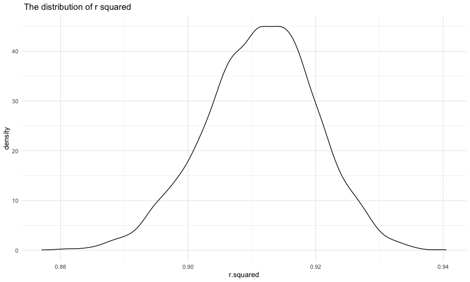
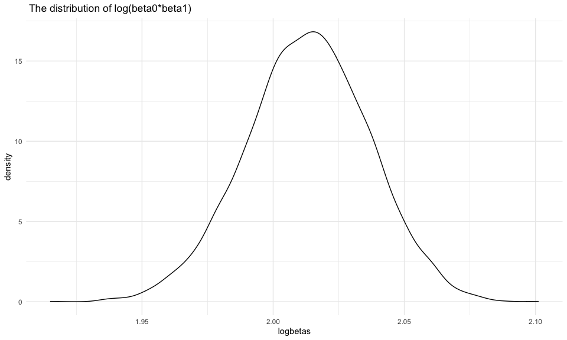

P8105 Homework 6
================
Jiayi Zhou(jz3336)
12/7/2020

## Probelm 1:

``` r
homicide_df = 
  read_csv("./data/homicide-data.csv") %>% 
  mutate(
    city_state = str_c(city, state, sep = "_"),
    victim_age = as.numeric(victim_age),
    resolution = case_when(
      disposition == "Closed without arrest" ~ 0,
      disposition == "Open/No arrest"        ~ 0,
      disposition == "Closed by arrest"      ~ 1,
    )
  ) %>% 
  filter(city_state != "Tulsa_AL",
         victim_race %in% c("White", "Black")) %>% 
  select(city_state, resolution, victim_age, victim_race, victim_sex)
```

Start with one city:

``` r
baltimore_df = 
  homicide_df %>% 
  filter(city_state == "Baltimore_MD")

glm(resolution ~ victim_age + victim_race + victim_sex,
    data = baltimore_df,
    family = binomial()) %>% 
  broom::tidy() %>% 
  mutate(
    OR = exp(estimate),
    CI_lower = exp(estimate - 1.96 * std.error),
    CI_upper = exp(estimate + 1.96 * std.error)
  ) %>% 
  select(term, OR, starts_with("CI")) %>% 
  knitr::kable(digit = 3)
```

| term              |    OR | CI\_lower | CI\_upper |
| :---------------- | ----: | --------: | --------: |
| (Intercept)       | 1.363 |     0.975 |     1.907 |
| victim\_age       | 0.993 |     0.987 |     1.000 |
| victim\_raceWhite | 2.320 |     1.648 |     3.268 |
| victim\_sexMale   | 0.426 |     0.325 |     0.558 |

Try this across cities:

``` r
model_results_df = 
  homicide_df %>% 
  nest(data = -city_state) %>% 
  mutate(
    models = map(.x = data, ~glm(resolution ~ victim_age + victim_race + victim_sex, data = .x, family = binomial())),
    results = map(models, broom::tidy)
  ) %>% 
  select(city_state, results) %>% 
  unnest(results) %>% 
  mutate(
    OR = exp(estimate),
    CI_lower = exp(estimate - 1.96 * std.error),
    CI_upper = exp(estimate + 1.96 * std.error)
  ) %>% 
  select(city_state, term, OR, starts_with("CI"))
```

Plot:

``` r
model_results_df %>% 
  filter(term == "victim_raceWhite") %>% 
  mutate(city_state = fct_reorder(city_state, OR)) %>% 
  ggplot(aes(x = city_state, y = OR)) +
  geom_point() + 
  geom_errorbar(aes(ymin = CI_lower, ymax = CI_upper)) + 
  theme(axis.text.x = element_text(angle = 90, vjust = 0.5, hjust = 1))
```


**comment:** This is plot of odd ratios which compared white homicide
victims to black homicide victims. The odd ratios in the majority of the
city sates are larger than 1. Therefore, relative to black homicide
victim, homicides in which the victims are white are much more likely to
be resolved.

## Problem 2

#### Clean data:

``` r
birthweight = 
  read_csv("./data/birthweight.csv") %>% 
  mutate(
    babysex = as.factor(case_when(
      babysex == 2 ~ "female", 
      babysex == 1 ~ "male"
    )),
    frace = as.factor(frace),
    malform = as.factor(malform),
    mrace = as.factor(mrace)
    )
```

check for NA:

``` r
birthweight %>% 
  drop_na()
```

    ## # A tibble: 4,342 x 20
    ##    babysex bhead blength   bwt delwt fincome frace gaweeks malform menarche
    ##    <fct>   <dbl>   <dbl> <dbl> <dbl>   <dbl> <fct>   <dbl> <fct>      <dbl>
    ##  1 female     34      51  3629   177      35 1        39.9 0             13
    ##  2 male       34      48  3062   156      65 2        25.9 0             14
    ##  3 female     36      50  3345   148      85 1        39.9 0             12
    ##  4 male       34      52  3062   157      55 1        40   0             14
    ##  5 female     34      52  3374   156       5 1        41.6 0             13
    ##  6 male       33      52  3374   129      55 1        40.7 0             12
    ##  7 female     33      46  2523   126      96 2        40.3 0             14
    ##  8 female     33      49  2778   140       5 1        37.4 0             12
    ##  9 male       36      52  3515   146      85 1        40.3 0             11
    ## 10 male       33      50  3459   169      75 2        40.7 0             12
    ## # … with 4,332 more rows, and 10 more variables: mheight <dbl>, momage <dbl>,
    ## #   mrace <fct>, parity <dbl>, pnumlbw <dbl>, pnumsga <dbl>, ppbmi <dbl>,
    ## #   ppwt <dbl>, smoken <dbl>, wtgain <dbl>

There is no NA since the data frame stayed the same after `drop_na`

#### Fit Models:

I hope to build a model using family income and mother’s weight gain
during pregnancy as predictors while baby’s birth wight is the outcome.
I hypothesized that baby’s birth weight is positively influenced by
family income and mother’s weight gain during pregnancy. Therefore, I
updated my dataset and only kept the variables that I would like to
investigate and needed by the other two models.

``` r
birthweight_df =
  birthweight %>% 
  select(bwt, gaweeks, blength, bhead, babysex, fincome, wtgain)
```

my model:

``` r
model_1 = lm(bwt ~ fincome + wtgain, data = birthweight_df) 

#check result
model_1 %>% 
  broom::tidy()
```

    ## # A tibble: 3 x 5
    ##   term        estimate std.error statistic  p.value
    ##   <chr>          <dbl>     <dbl>     <dbl>    <dbl>
    ## 1 (Intercept)  2718.      21.1       129.  0.      
    ## 2 fincome         3.13     0.286      10.9 1.96e-27
    ## 3 wtgain         11.7      0.679      17.2 2.84e-64

plot of model residuals against fitted values:

``` r
birthweight_df %>% 
  add_residuals(model_1) %>% 
  add_predictions(model_1) %>% 
  ggplot(aes(x = pred, y = resid)) + 
  geom_point() + 
  labs(
    title = "Plot of residuals vs. fitted values", 
    x = "Fitted values", 
    y = "Residuals", 
    caption = "Model 1"
  )
```


Cross validation:

``` r
cv_df = 
  crossv_mc(birthweight_df, 100) %>% 
  mutate(
    train = map(train, as_tibble),
    test = map(test, as_tibble)) %>% 
  mutate(
    model_1  = map(train, ~lm(bwt ~ fincome + wtgain, data = .x)),
    model_2  = map(train, ~lm(bwt ~ blength + gaweeks, data = .x)),
    model_3  = map(train, ~lm(bwt ~ blength*bhead*babysex, data = .x))) %>% 
  mutate(
    rmse_1 = map2_dbl(model_1, test, ~rmse(model = .x, data = .y)),
    rmse_2 = map2_dbl(model_2, test, ~rmse(model = .x, data = .y)),
    rmse_3 = map2_dbl(model_3, test, ~rmse(model = .x, data = .y)))
```

plot showing the distribution of RMSE values for each candidate model:

``` r
cv_df %>% 
  select(starts_with("rmse")) %>% 
  pivot_longer(
    everything(),
    names_to = "model", 
    values_to = "rmse",
    names_prefix = "rmse_") %>% 
  mutate(model = fct_inorder(model)) %>% 
  ggplot(aes(x = model, y = rmse)) + geom_violin() +
  labs(
    title = "Violin plot comparing RMSE value for the three candidate models", 
    x = "Model", 
    y = "RMSE"
  )
```


**comment**: The best model is model three which used head
circumference, length, sex, and all interactions (including the
three-way interaction) between these as the predictors of baby’s birth
weight.

## Problem 3:

Set up

``` r
weather_df = 
  rnoaa::meteo_pull_monitors(
    c("USW00094728"),
    var = c("PRCP", "TMIN", "TMAX"), 
    date_min = "2017-01-01",
    date_max = "2017-12-31") %>%
  mutate(
    name = recode(id, USW00094728 = "CentralPark_NY"),
    tmin = tmin / 10,
    tmax = tmax / 10) %>%
  select(name, id, everything())
```

#### r squared

``` r
#Bootstrapping
r_squared = 
  weather_df %>% 
  bootstrap(n = 5000, id = "strap_number") %>% 
  mutate(
    models = map(strap, ~lm(tmax ~ tmin, data = .x) ),
    results = map(models, broom::glance)) %>% 
  select(strap_number, results) %>% 
  unnest(results)


#Distribution plot
r_squared %>% 
  ggplot(aes(x = r.squared)) +
  geom_density() +
  labs(
    title = " The distribution of r squared"
  )
```



``` r
#Confidence interval
r_squared %>% 
  summarize(
    CI_lower = quantile(r.squared, 0.025),
    CI_upper = quantile(r.squared, 0.975)
  )
```

    ## # A tibble: 1 x 2
    ##   CI_lower CI_upper
    ##      <dbl>    <dbl>
    ## 1    0.894    0.927

**comment:** After 5000 bootstrapping, the distribution of estimated
`r-squared` is close to normal, where its peak occurs at around 0.915.
The confidence interval of all estimated `r-squared` values is
(0.894，0.927).

#### log(beta0\*beta1)

``` r
beta = 
  weather_df %>% 
  bootstrap(n = 5000, id = "strap_number") %>% 
  mutate(
    models = map(strap, ~lm(tmax ~ tmin, data = .x) ),
    results = map(models, broom::tidy)) %>% 
  select(strap_number, results) %>% 
  unnest(results)  %>% 
  pivot_wider(
    names_from = term,
    values_from = estimate) %>% 
  select(strap_number, `(Intercept)`,  tmin) %>% 
  group_by(strap_number) %>% 
  summarise_all(na.omit) %>% 
  mutate(
    logbetas = log(`(Intercept)`* tmin)
  )

##Distribution plot
beta %>% 
  ggplot(aes(x = logbetas)) +
  geom_density() +
  labs(
    title = " The distribution of log(beta0*beta1)"
  )
```



``` r
#Confidence interval
beta %>% 
  summarize(
    CI_lower = quantile(logbetas, 0.025),
    CI_upper = quantile(logbetas, 0.975)
  )
```

    ## # A tibble: 1 x 2
    ##   CI_lower CI_upper
    ##      <dbl>    <dbl>
    ## 1     1.97     2.06

**comment:** After 5000 bootstrapping, the distribution of estimated
`log(beta0*beta1)` is close to normal, where its peak occurs at around
2.01. The confidence interval of all estimated values `log(beta0*beta1)`
is (1.97,2.06).
